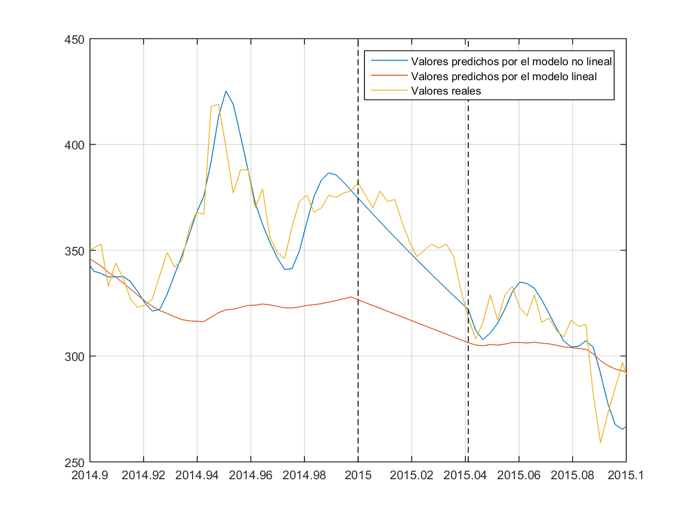
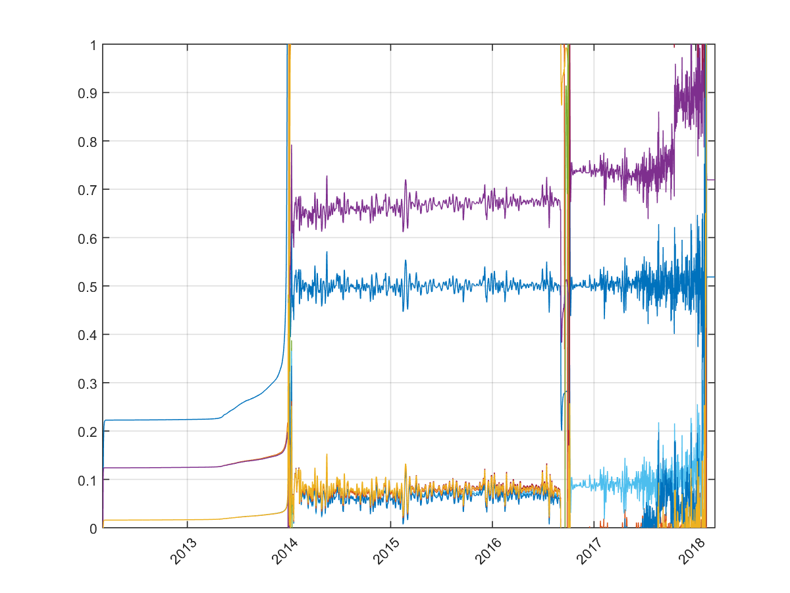

# Kalman application to stocks

Application of the standard and extended Kalman filters to an AR-N Model (autoregressive model) that intends to represent the variation of assets in time. These algorithms were principally applied to the Bitcoin value time series.

__Author: Gonzalo Quintana__

## Files

`Kalman application to stocks.pdf`: report with theoretical explanations and experiments.

`KalmanForStocksv7.m`: algorithms with measurement and prediction steps.

`KalmanForStocksv8.m`: algorithms without any measurements for 15 days (only predictions).

`KalmanForStocksBarridoMatrices.m`: calculates MSE for different variances of the process and meausurement noises.

## Results

## AR model coefficients

